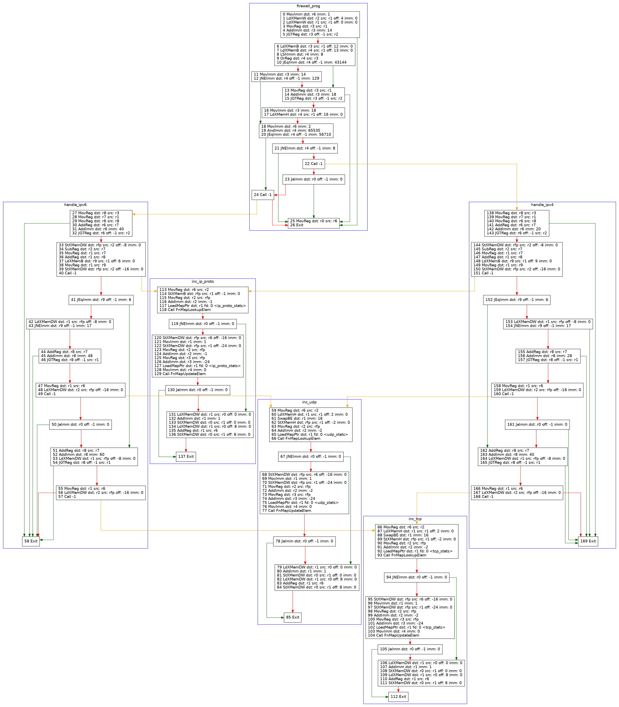
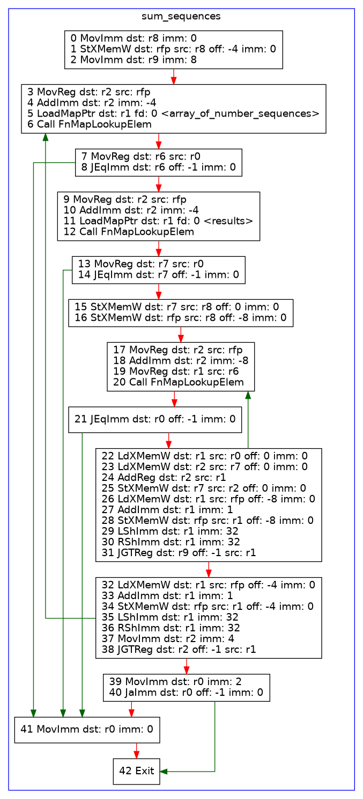
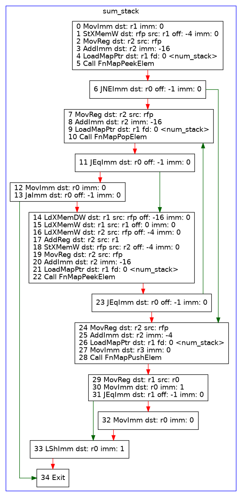

# EDB (eBPF debugger)

`edb` is a debugger(like gdb and dlv) for eBPF programs. Normally eBPF programs are loaded into the Linux kernel and then executed, this makes it difficult to understand what is happening or why things go wrong. For normal applications we can use gdb or dlv to inspect programs, but these don't work for the eBPF due to the way eBPF is loaded into the kernel.

`edb` uses userspace eBPF [emulation](https://github.com/dylandreimerink/mimic#mimic-ebpf-userspace-emulator) to run eBPF programs instead of loading them into the kernel, this allows us to debug them like any other program. Altho this method is not perfect due to possible differences between the emulator and actual Linux machines, it is better than nothing.

>**WARNING/NOTE** This project is still a work in progress, so is the emulator on which it runs. Not all eBPF programs might run inside the debugger or some features might be missing. Please take a look at the [issues]([#TODO](https://github.com/dylandreimerink/edb/issues)) of this projects and the [TODO](https://github.com/dylandreimerink/mimic#features--todo) of the emulator for a list of missing features.

## Installation

### Clone and install

Currently installing the old-school is the only way to install `edb`. Using `go install` on the URL doesn't work due to our dependency on the replace directives in go.mod 

```bash
git clone https://github.com/dylandreimerink/edb.git
cd edb
go install .
```

### Binary release

1. Get the latest `edb` version at https://github.com/dylandreimerink/edb/releases for your platform
2. un-tar and place in $PATH `sudo tar -C /usr/local/bin -xzf edb_0.1.0_Linux_x86_64.tar.gz`
3. verify install `edb --help`

## Usage

```
EDB is a debugger for eBPF programs

Usage:
  edb [command]

Available Commands:
  capture-context Capture program contexts
  completion      Generate the autocompletion script for the specified shell
  debug           debug starts an interactive debug session
  graph           Generate a control-flow graph for an eBPF program
  help            Help about any command
  pcap-to-ctx     Convert a PCAP(packet capture) file into a context file which can be passed to a XDP eBPF program

Flags:
  -h, --help   help for edb

Use "edb [command] --help" for more information about a command.
```

### `edb debug` interactive debugger

Use the `help` command to get a list of all top level commands. You can get more details about a command by passing its name like `help help` or `help program`
```
(edb) help
Commands:
  help (Alias: h) ------------------------- Show help text / available commands
  exit (Aliases: q, quit) ----------------- Exits the debugger
  clear ----------------------------------- Clear the screen
  load ------------------------------------ Load an ELF file
  context (Alias: ctx) -------------------- Context related commands
  program (Alias: prog) ------------------- Program related commands
  reset ----------------------------------- Reset the registers of the VM
  registers (Aliases: r, regs) ------------ Show registers
  step-instruction (Alias: si) ------------ Step through the program one instruction a time
  list-instructions (Alias: li) ----------- Lists the instructions of the program
  step (Alias: s) ------------------------- Step through the program one line a time
  list (Alias: ls) ------------------------ Lists the lines of the source code
  map (Alias: maps) ----------------------- Map related operations
  memory (Alias: mem) --------------------- Show the contents of memory
  breakpoint (Aliases: b, br, bp, break) -- Commands related to breakpoints
  continue (Alias: c) --------------------- Continue execution of the program until it exits or a breakpoint is hit
  continue-all (Alias: ca) ---------------- Continue execution of the program for all contexts
  macro (Alias: mc) ----------------------- Macros allow you to execute a series of commands
```

```
(edb) help context
context {sub-command} - Context related commands

Sub commands:
  list (Alias: ls) ------------------------ List loaded contexts
  load (Alias: ld) ------------------------ Load a context JSON file
  set ------------------------------------- Sets the current context
```

```
(edb) help program
program {sub-command} - Program related commands

Sub commands:
  list (Alias: ls) ------------------------ List all loaded programs
  set ------------------------------------- Sets the entrypoint program
```

```
(edb) help map
map {sub-command} - Map related operations

Sub commands:
  list (Alias: ls) ------------------------ Lists all loaded maps
  read-all -------------------------------- Reads and displays all keys and values
  get ------------------------------------- Get the value of a particular key in a map
  set ------------------------------------- Set a value at a particular spot in a map
  del ------------------------------------- Delete a value from a map with the given key
  push (Alias: enqueue) ------------------- Push/enqueue a value into the map
  pop (Alias: dequeue) -------------------- Pop/dequeue a value from the map, this shows and deletes the value
```

```
(edb) help memory
memory {sub-command} - Show the contents of memory

Sub commands:
  list (Alias: ls) ------------------------ List all memory objects and their addresses
  read ------------------------------------ Read the contents of a specific virtual address
  read-all -------------------------------- Read and show the whole contents of addressable memory
```

```
(edb) help breakpoint
breakpoint {sub-command} - Commands related to breakpoints

Sub commands:
  list (Alias: ls) ------------------------ List all breakpoints
  set (Alias: add) ------------------------ Set a new breakpoint
  enable ---------------------------------- Enable a breakpoint
  disable --------------------------------- Disable a breakpoint
```

```
(edb) help macro
macro {sub-command} - Macros allow you to execute a series of commands
You might encounter a situation in which you would like to combine multiple commands so you can repeately execute them by pressing <enter>. Macros can also be useful if you find that you have to do a lot of setup work for a specific program(loading the ELF, changing entrypoint, setting map values). In such cases being able to execute a macro from a file can save a lot of time.
Sub commands:
  list (Alias: ls) ------------------------ List all loaded macros
  show ------------------------------------ Shows the commands in a macro
  start ----------------------------------- Start recording a macro
  stop ------------------------------------ Stop recording a macro
  save ------------------------------------ Save a macro to a file
  load ------------------------------------ Load macro(s) from a file
  un-load --------------------------------- Unloads a macro, permanently deleting it if not saved
  exec ------------------------------------ Execute a macro
  run ------------------------------------- Parses a macro file and runs all macros within
  set ------------------------------------- Sets a line within a macro
  del ------------------------------------- Deletes a line from a macro
```

### `edb graph`

```
This command reads the provided ELF file and creates a control-flow graph for the given program. The program is broken up into 'blocks' of code by BPF-to-BPF function calls and branching instructions. Red arrows indicate the non-branching path, green arrows indicate the branching path, yellow arrows indicate bpf-to-bpf function calls(which will return and then follow the non-branching path).

If no flags are specified the command will attempt to render the graph as SVG and open it in the browser.

Usage:
  edb graph {ELF} {program name} [flags]

Flags:
  -f, --format string   The output format: dot, svg, pdf or png (default "svg")
  -h, --help            help for graph
  -o, --output string   output to given file path or - for stdout, instread of opening in browser
```


### `edb pcap-to-ctx`
```
Convert a PCAP(packet capture) file into a context file which can be passed to a XDP eBPF program

Usage:
  edb pcap-to-ctx {.pcap input} {.json ctx output} [flags]

Flags:
  -h, --help   help for pcap-to-ctx
```

Usage example:
```bash
tcpdump -i eth0 -w example.pcap
edb pcap-to-ctx example.pcap example.ctx.json
edb debug
Type 'help' for list of commands.
(edb) ctx load example.ctx.json
43 contexts were loaded
(edb) ctx list
 =>  0 2022-01-25 20:11:16.471543 +0000 UTC (xdp_md + 0)
     1 2022-01-25 20:11:16.715942 +0000 UTC (xdp_md + 0)
     2 2022-01-25 20:11:16.717875 +0000 UTC (xdp_md + 0)
     3 2022-01-25 20:11:16.87141 +0000 UTC (xdp_md + 0)
    ...
    41 2022-01-25 20:11:19.120006 +0000 UTC (xdp_md + 0)
    42 2022-01-25 20:11:19.120006 +0000 UTC (xdp_md + 0)
```

<!-- ### `edb capture-context` -->
